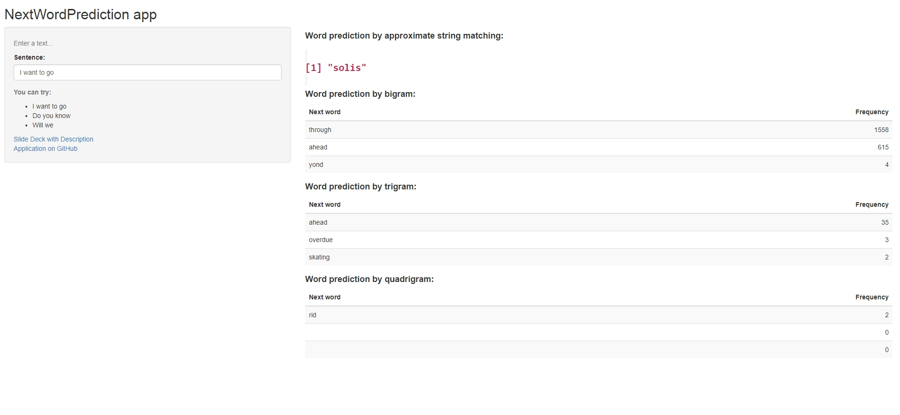

Description of NextWordPrediction App
========================================================
author: Cherubael
date: 31 July 2018
autosize: true
transition: zoom

Introduction
========================================================

This work is part of Capstone project from Coursera Data Science specialization.

The goal of this exercise was to create a product to highlight the prediction algorithm that I have built and to provide an interface that can be accessed by others.

This presentation describes mechanism of N-grams dictionary building and principle of application work.

Mining of N-grams
========================================================
It was hard.

Initially I tried to randomly read training datasets and extract sample in size of 50.000 from each dataset.
I repeated this procedure many times: 10, 50, 100, 300, 1000, and always I had found that total amount of N-grams is non enriched.

OK. I read training datasets piece by piece to get satisfying set of N-grams. Merged three datasets, step by step.
Total time to build all types of N-grams was abotu 12 hours.

N-grams mining over all datasets
========================================================
As a result, I went through the entire data set, selecting portions of 1000 vectors at a time. All N-grams were saved, minus those whose frequency was less than 1. 
The results of processing the combined dataset for detecting bigrams, trigrams, and quadrigram are shown below.

The bends of the straight line correspond to three sets of data: blogs, twits, and news.

Principle of application work
========================================================
The application is simple and intuitive.
The application subsequently searches for a possible sentence for the entered sequence of words. The first line of results is a fuzzy search among the combined sets of digrams, trigrams and quadrices.

Fuzzy search based on function `amatch` from `stringdist` package. Then comes the conclusion of the three most possible words based on the search by:
- bigrams
- trigrams
- quadrigrams

If the length of the sentence is not sufficient, or if it is not possible to suggest the next word from the dictionary, the forecast is made based on a fuzzy search algorithm.

Common view of application
========================================================

Conclusion
========================================================
In fact, the quality of the application leaves much to be desired. To improve it, I need to significantly improve the algorithm for cleaning the source texts, and also use not only dictionary search, but some various models, such as naive Bayesian, Markov chains, and etc.

I think that the combination of several models and approaches combined into one ensemble of models would be optimal, but it seems to me that the goal of this project was, first of all, to get pleasure, which happened.

Thank you for attention!
========================================================
Application on GitHub: https://github.com/ariel32/NextWordPrediction

Application on Shiny.io: https://capsula.shinyapps.io/NextWordPrediction
